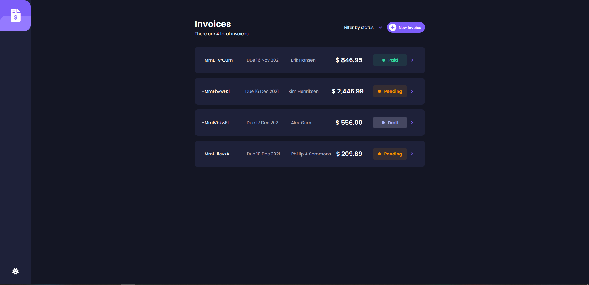
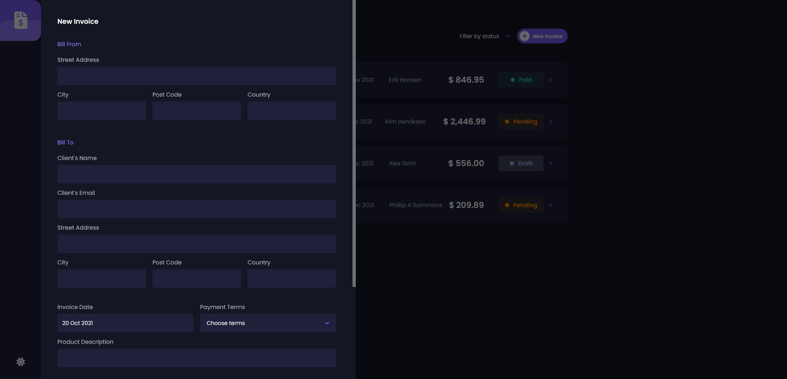
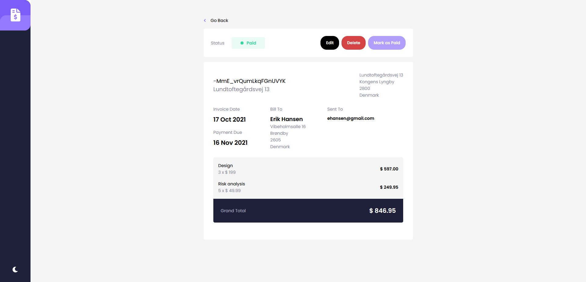
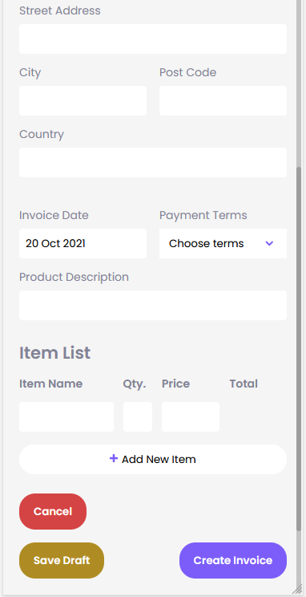

# Frontend Mentor - Fullstack Invoice app with color theme switcher

This is a solution to the [Invoice App with color theme switcher challenge on Frontend Mentor](https://www.frontendmentor.io/challenges/invoice-app-i7KaLTQjl). 

### The challenge

Users should be able to:

- View the optimal layout for the app depending on their device's screen size
- See hover states for all interactive elements on the page
- Create, read, update, and delete invoices
- Receive form validations when trying to create/edit an invoice
- Save draft invoices, and mark pending invoices as paid
- Filter invoices by status (draft/pending/paid)
- Toggle light and dark mode

### Screenshot

### Links

- Live Site URL: [Live App](https://invoices-mentor.netlify.app/)

### Built with

- HTML5
- SCSS
- Flexbox & Grid
- Mobile-first workflow
- [Angular](https://angular.io/)

### What I learned

Have worked with Angular before, but this was my first time trying the BrowserAnimationModule to animate a slide-in-out component.
Also got to make it fullstack by making use of a firebase realtime database to store data.